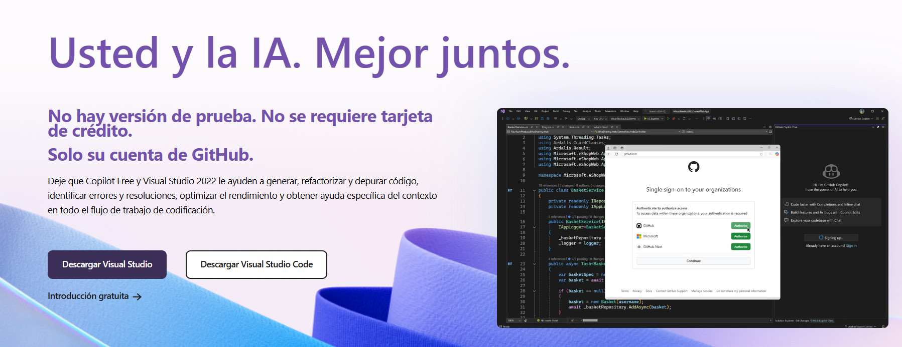
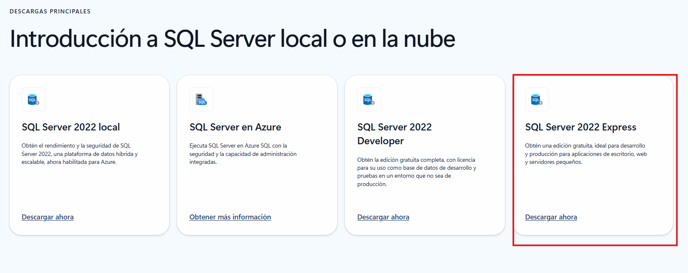
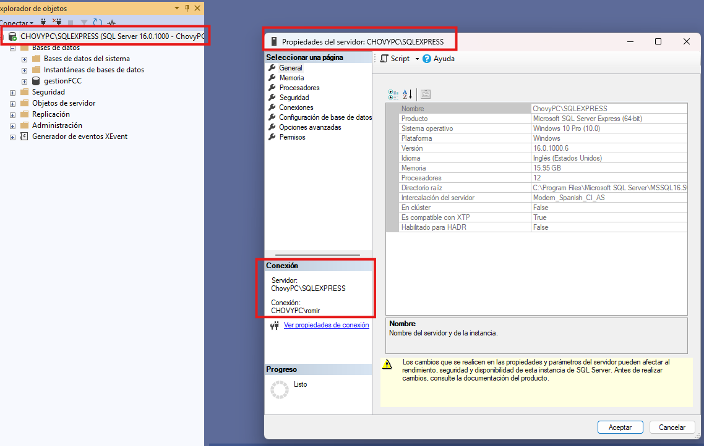
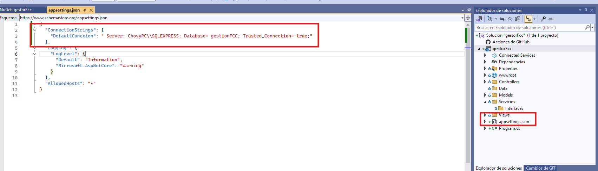
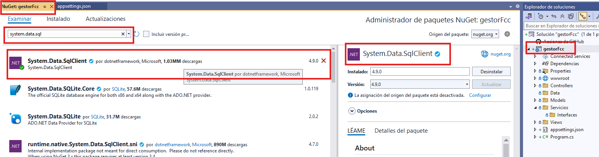
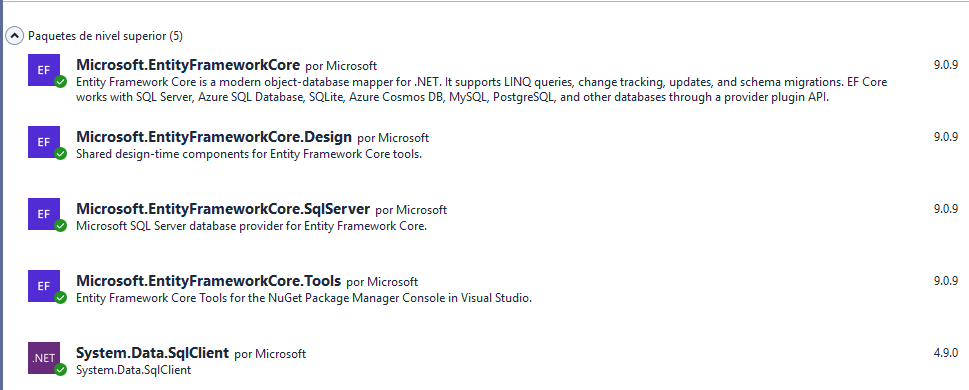
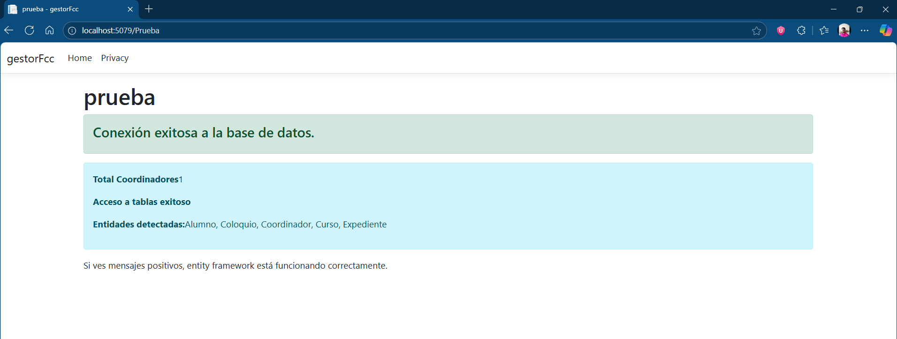

# 1. Sistema de Gestión Académica de Posgrado

# Indice
- [1. Sistema de Gestión Académica de Posgrado](#1-sistema-de-gestión-académica-de-posgrado)
- [Indice](#indice)
  - [1.2. Objetivo del documento](#12-objetivo-del-documento)
  - [Herramientas de desarrollo utilizadas](#herramientas-de-desarrollo-utilizadas)
  - [Base de datos](#base-de-datos)
    - [Desarrollo del Script](#desarrollo-del-script)
  - [Desarrollo del Sistema](#desarrollo-del-sistema)
    - [Creación del proyecto](#creación-del-proyecto)
    - [Conexión a la base de datos](#conexión-a-la-base-de-datos)

## 1.2. Objetivo del documento

Este presente documento es realizar todas las anotaciones de desarrollo, para quien desee conntinuar con ello o en su debido caso realizar las modificaciones de acuerdo a lo que se presente.

Todo el proyecto es creado con fines educativos, en el repositorio en donde se encuentre ubicado puede no contener dependencias necesarias para la funcionalidad correcta del proyecto

## Herramientas de desarrollo utilizadas

- **C#**: Una vez descargado e instalado **Visual Studio** (versión gratuita), en la parte de seleccionar los **workloads** de manera en conjunto o individual es indispensable seleccionar el uso para aplicaciones web (**ASP.NET Core MVC**), uso de azure y herramientas de uso de bases de datos, es indispensable tener disponible en el equipo:
  - Aproximado de 20Gb de almacenamiento minímo para la instalación de las dependencias y carga de trabajo.
  - Conexión a internet con banda ancha competente
  - 8 gb de memoria RAM y un procesador i3, ryzen 3 o superiores.

- **SQL Server**: Puedes entrar a esta pagina **https://www.microsoft.com/es-mx/sql-server/sql-server-downloads** una vez instalado se te podrá recomendar en la página de inicio de SQL Server descargar su versión SSMS, en pocas palabras es utilizar la versión de interfaz gráfica de usuario, ya que solo usará en debido caso el uso de la version cmd de SQL
- Adicionales:
  - Git y controladores de versiones para ambas herramientas; facilitan el uso de git y github (si posees cuenta) en omitir el uso de comandos para agilizar los controles de versiones de la aplicación y modificaciones a la base de datos.
  - Todo el proyecto se esta utilizando las versiones gratuitas disponibles (no versiones de prueba)

- **Git/Github**: Es recomendable que domines el uso y desempeño del control de versiones git y subir los cambios a un repositorio que puedas crear y tener a la mano en Github, el uso de los comandos de Git tiene una curva de dificultad muy sencilla de dominar para explotar el potencial de manejar posibles versiones para el desarrollo de sistema

## Base de datos

En el repositorio original puedas encontrar el script en sql que podrás descargar y utilizar en sql server, es importante tener en cuenta que se esta trabajando con la versión: **21**

### Desarrollo del Script

Una vez leído en la página 74 del documento del sistema se encuentra la figura 26 que es el diagrama de relación de la base de datos del sistema, en principio solo tiene relaciones **1 a N o N a 1**, en este caso no se están utilizando llaves foráneas por la razón de que es un sistema dirigido a una menor población a la que se maneja en la facultad, aquí estamos desarrollando un sistema de gestión para un posgrado que se entiende que la población es inferior a 1000 y no hay pruebas de que eso pueda superarse.

En la parte final del script se añadieron dos tres columnas una para cada tabla en uso y control de que la información se manipule con control de parte del sistema y no existan problemas a la hora de que llegue a sus manos del cliente.

## Desarrollo del Sistema

### Creación del proyecto

Se utiliza la opción ASP.NET Core con el uso de MVC con las configuraciones que vienen por defecto, en este caso lo importante es no permitir que cuando el sistema se levanta tenga https, solo desactivar esa funcion del recuadro

### Conexión a la base de datos

**SQL Server Managment** usualmente utiliza el nombre de la computadora en cuestión donde estas trabajando para darle un nombre al servidor en donde estará alojado tus bases de datos que vayas creando, es importante que tengas en cuenta el nombre del servidor que fue asignado:

Podrás observar que al dar en el menú de contexto te despliegan todas las propiedades del servidor, entonces debes tomar nota el nombre de tu servidor.

Si estás a empezando a crear el proyecto desde 0, deberás entrar al archivo .json del proyecto en visual studio y agregar en el formato la misma estructura que observas en la imagen de abajo:

Una vez configurado ahora deberas descargar los paquetes **NuGet** dando al botón derecho en el ícono del proyecto y abrir el menú contextual y buscar la opción mencionado y descargar:

Para recapitular debes contener ya esto instlado en la parte de NuGet para poder trabajar con el proyecto y realizar la conexión a la base de datos que vas a utilizar:

Ahora la estructura del proyecto con sus respcetivos directorios para tener un mayor control sobre lo que se está manejando en utilizar el modo MVC y separar entre el uso de clases y el uso de datos en las tablas de las bases de datos así como utlizarlos para las versiones de vista.

GestionPosgradoFCC.sln
├── GestionPosgradoFCC.Web/          # ASP.NET Core MVC
│   ├── Controllers/
│   │   ├── AccountController.cs     # ← Login/Logout
│   │   ├── AdminController.cs       # ← Recuperación de credenciales  
│   │   ├── AlumnosController.cs
│   │   └── DocentesController.cs
│   │
│   ├── Models/                      # ✅ AQUÍ van los modelos de VISTA
│   │   ├── Account/                 # ← Models para autenticación
│   │   │   ├── LoginModel.cs        # ← Modelo para vista Login
│   │   │   └── RecoveryModel.cs     # ← Modelo para vista Recuperación
│   │   │
│   │   ├── Alumno.cs                # Modelos del dominio
│   │   └── Docente.cs
│   │
│   ├── Views/
│   │   ├── Account/                 # ← Vistas de autenticación
│   │   │   ├── Login.cshtml
│   │   │   └── Recovery.cshtml
│   │   ├── Admin/                   # ← Vistas de administración
│   │   │   └── ResetPassword.cshtml
│   │   ├── Alumnos/
│   │   └── Docentes/
│   │
│   └── wwwroot/
│
├── GestionPosgradoFCC.Data/         # Entity Framework
│   ├── Entities/                    # ✅ AQUÍ van las ENTIDADES de BD
│   │   ├── Coordinador.cs        # ← ENTIDAD de la tabla de donde uno logea
│   │   ├── Alumno.cs
│   │   └── Docente.cs
│   │
│   ├── ApplicationDbContext.cs
│   └── Migrations/
│
└── GestionPosgradoFCC.Core/         # Lógica de negocio
    ├── Services/                    # ✅ AQUÍ va la lógica de autenticación
    │   ├── AuthService.cs           # ← Validar login, hashing
    │   └── UserService.cs           # ← Gestión de usuarios
    │
    ├── Interfaces/
    │   └── IAuthService.cs
    │
    └── DTOs/                        # Objetos de transferencia
        └── UserDTO.cs

**Nota**:
Observa que los archivos son de demostración estos mismos pueden cambiar su nombre de acuerdo a la estructura que puedas trabajar.

En el momento que tengas la estructura del proyecto mapeada, ahora en la carpeta/directorio de **Data** deberas agregar una clase vacía en C# para construir el contexto de la base de datos a la aplicación, en resumen es el puente de conexión que se necesita para que la aplicación pueda entrar a la base de datos, en el repositorio lo puedes encontrar en la ubicación del archivo que mencionó y ver la estructura del código, en palabras sencillas toma la etiqueta del JSON que este mismo contiene los nombres del servidor y la base de datos, en la parte final es el mapeo del uso de las tablas correspondientes, en este caso son 6, observarás que presenta errores porque no entiende lo que haces referencia, aquí es cuando ahora pasas a mapear y asignar los nombres de las columnas de cada una de las respectivas tablas.

Debes crear las clases en la carpeta de **Data/Entidades** y coidifcar cada una de las columnas como esta presentado en el repositorio, teniendo cuidado que si realizarás registros y existen datos que no puedes dejar vacíos debes etiquetarlos aquí, para reforzar la seguridad de que no 
mandarán campos importantes como vacíos, también indica la llave primaria y los datos que son para el uso de fechas o tiempo.

Una vez terminado  ejecutas en la consola del administrador de paquetes: # **Pestaña de Ver >> Otras Ventanas >> Consola de Admin. paquetes**
- **Remove-Migration**
- **Add-Migration TablasExistentes -o Migrations**
- Despés vacía los métodos up y down en el archivo tablasexistentes.cs ubicado en la carpeta **Migrations**
- **Update-Database**

Para verificar que esto esta funcionando correctamente que la aplicación usa la base de datos del servidor, puedes comprobarlo en uso del script en el repositorio ubicado en la carpeta de Base Datos que lleva por mismo nombre.

Y para el lado del cliente puedes usa el index ubicado en **Views >> Prueba >> Index.cshtml**
- Ejecutar la aplicación y comprobar que funciona correctamente.

Solo recuerda escribir el nombre del directorio de **Prueba** para poder visualizar el resultado.

Escrito y desarrollado por **Rodolfo Romero Miron**, *2025*